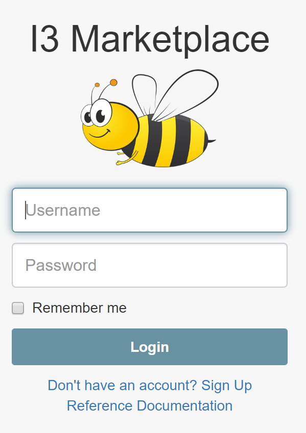

# Connecting an IoT device to the I3 Data Marketplace

<b>This tutorial is for developers with an IoT device who want to participate in the I3 Marketplace.</b>  One goal of the [I3 Consortium](https://i3.usc.edu/about/i3-consortium/) is building a marketplace for buying and selling data. The I3 Marketplace is like an online store that sells "topics" rather than products. 

Sellers use IoT devices to gather data about topics. In order to sell their data, a seller registers their device and publishes their topic.  A buyor pays a fee to subscribe to it. You can buy or sell all kinds of topics. Some valuable topics include "parking spaces" and "air quality".  

Suppose you want to go to an event. You can buy a parking space in advance rather than waste gas driving around looking for one. If you have asthma, you can buy data about the air quality.  You can also get a local weather report or foot traffic data or data from your community garden.  Data brokers can combine data in meaningful ways to report traffic conditions or earthquakes or other events.

## Designing device capabilities

To buy or sell data, you need an IoT device capable of running [MQTT](https://en.wikipedia.org/wiki/MQTT).  [MQTT libraries](http://mqtt.org/) are available in multiple programming languages, including Python, Java, JavaScript, C, and others.  These tutorials use the [MQTT libraries for Python](https://pypi.org/project/paho-mqtt/):

 - <a href="https://github.com/NelsonPython/AstroPiOTA">AstroPiOTA environment sensor</a>

- <a href="https://github.com/NelsonPython/EnviroPhat">EnviroPhat weather station</a>

- <a href="https://github.com/NelsonPython/CO2TVOC">CO2-TVOC air quality sensor</a>

## Setting up test accounts

You also need to setup your account and register your topic at the <a href="http://3.15.198.123:8000/" target="Top">I3 Marketplace

</a>

## Testing your device

In order to test your device, create a seller account to publish your data and a different buyer account to subscribe to your data stream.  Using your seller account, register your topic at [I3 Marketplace](http://3.15.198.123:8000/).  Click the Documentation menu item for step-by-step instructions.  Using your buyer account, purchase your topic. 

## Programming a publisher and a subscriber

Each tutorial includes a step-by-step code walkthrough explaining its data publisher and subscriber.  The publisher takes one sensor reading and publishes it.  The publisher is scheduled to run periodically, for example, every 30 minutes.

The subscriber retrieves the sensor data as it is published and saves the data to the IOTA Tangle.  The Tangle is used for storing data and exchanging value.

## Scheduling the publisher

If you are using Linux, then you can use cron to schedule a shell script to run the publisher
```
crontab -e
```
In this example, I3.sh has been schedule to run every 30 minutes

```
# Edit this file to introduce tasks to be run by cron.
#
# To define the time you can provide concrete values for
# minute (m), hour (h), day of month (dom), month (mon),
# and day of week (dow) or use '*' in these fields (for 'any')
# Notice that tasks will be started based on the cron's system
# daemon's notion of time and timezones.
#
# Output of the crontab jobs (including errors) is sent through
# email to the user the crontab file belongs to (unless redirected).
#
# m h  dom mon dow   command
*/30 * * * * /home/pi/I3-Consortium/I3.sh
```

I3.sh contains the command to run AstroPiOTA_pubish.py.  Remember to include the path and to change permissions so that I3.sh will run

```
sudo chmod +x
```

## Viewing your data subscription in the Tangle

You can use the [IOTA Tangle Explorer](https://devnet.thetangle.org/transaction/JIVBGUNDM9JYYYOTJYUARQKUPEB9SKSVXVLQVZEBNHQUL99R9SCHMHWJTZCSJIQAFDKMUBRRPRGJSR999) to view your data in the Tangle


