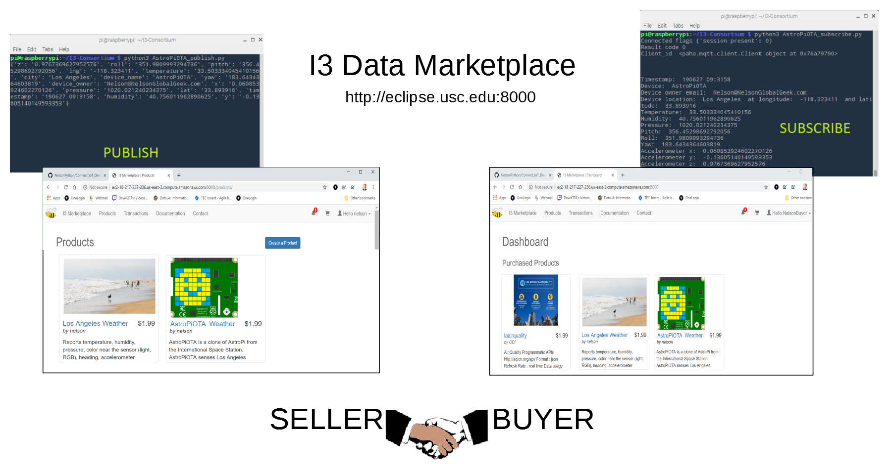
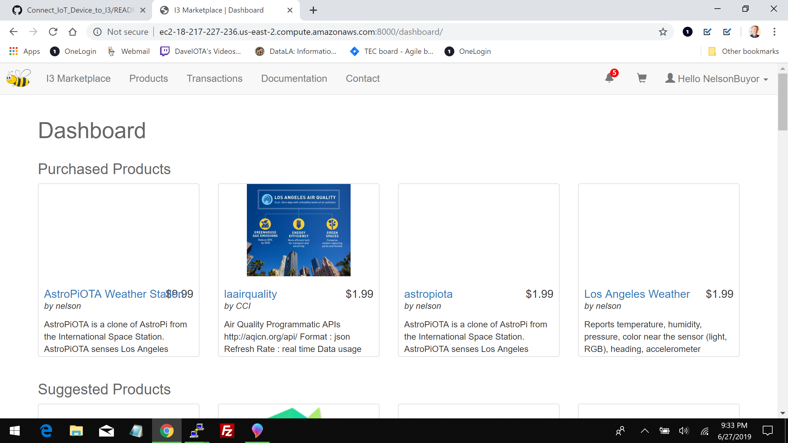

# Connecting an IoT device to the I3 Data Marketplace

One goal of the [I3 Consortium](https://i3.usc.edu/about/i3-consortium/) is building a data marketplace for buying and selling data.  Currently, the I3 Data Marketplace is a proof of concept.  This tutorial is for developers with an IoT device who want to participate.



### How the I3 Data Marketplace works

The Data Marketplace is like an online store that sells "topics" rather than products.  Topics are data. Valuable topics include "parking spaces", "air quality", "weather station", and more.  Suppose you want to go to an event. You can buy a parking space in advance rather than waste gas driving around looking for one. If you have asthma, you can buy data about the air quality.  You can also get the local weather report.

Sellers use IoT devices to gather data about topics. A seller is also called a data broker. In order to sell their data, a seller registers their device and publishes their topic.  A buyor pays a fee to subscribe to it. 

### Connecting the IoT device

To be a data broker, you need an IoT device capable of running [MQTT](https://en.wikipedia.org/wiki/MQTT).  [MQTT libraries](http://mqtt.org/) are available in multiple programming languages, including Python, Java, JavaScript, C, and others. 

### Setting up accounts

In order to test, you need a seller account to publish your data and a different buyer account to subscribe to your data stream.  Using your seller account, register your topic at [http://eclipse.usc.edu:8000](http://eclipse.usc.edu:8000).  Click the Documentation menu item for step-by-step instructions.  Using your buyer account, purchase your topic.  Here's a screen capture showing the products I purchased with my buyer account:



### Programming a publisher and a subscriber

I used two scripts:  AstroPiOTA_publish.py and AstroPiOTA_subscribe.py.  AstroPiOTA_subscribe.py creates the AstroPiOTA.csv log file with weather station data.

#### AstroPiOTA_publish.py

The purpose of this script is to publish environment data

#### AstroPiOTA_subscribe.py

AstroPiOTA publishes data every 30 minutes.  AstroPiOTA_subscribe.py connects to the I3 Data Marketplace and listens for data then saves it to the AstroPiOTA.csv log file and stores it on the Tangle.

### Scheduling the publisher

In order to publish data, I used cron to schedule a shell script that runs AstroPiOTA_publish.py.  You can edit your scheduler using this command:

```
crontab -e
```

Then set the schedule

```
# Edit this file to introduce tasks to be run by cron.
#
# To define the time you can provide concrete values for
# minute (m), hour (h), day of month (dom), month (mon),
# and day of week (dow) or use '*' in these fields (for 'any')
# Notice that tasks will be started based on the cron's system
# daemon's notion of time and timezones.
#
# Output of the crontab jobs (including errors) is sent through
# email to the user the crontab file belongs to (unless redirected).
#
# m h  dom mon dow   command
*/30 * * * * /home/pi/I3-Consortium/I3.sh
```

I3.sh contains the command to run AstroPiOTA_pubish.py

```
python3 /home/pi/I3-Consortium/AstroPiOTA_publish.py
```

Remember to change permissions so that I3.sh will run

```
sudo chmod +x
```

### Viewing the subscriber's log

Here's a sample of the data from AstroPiOTA

```
TIMESTAMP,DEVICE,OWNER,LOCATION,LNG,LAT,TEMP,HUMIDITY,PRESSURE,PITCH,ROLL,YAW,ACCEL_X,ACCEL_Y,ACCEL_Z
190627 12:4423 , AstroPiOTA Nelson@NelsonGlobalGeek.com , Los Angeles , -118.323411 33.893916 , 39.02166748046875 , 35.11812210083008 1020.120361328125 , 355.2495487907428 , 349.84132475120396 128.01344082075164 , 0.0807344913482666 , -0.17488877475261688 , 0.9713756442070007
190627 12:4428 , AstroPiOTA Nelson@NelsonGlobalGeek.com , Los Angeles , -118.323411 33.893916 , 38.948333740234375 , 35.325462341308594 1020.137451171875 , 355.2259880532008 , 349.86508783310006 128.34559292008936 , 0.0819467157125473 , -0.1751299947500229 , 0.972594141960144
190627 12:4744 , AstroPiOTA Nelson@NelsonGlobalGeek.com , Los Angeles , -118.323411 33.893916 , 39.07666778564453 , 35.390785217285156 1020.01123046875 , 355.16974784868813 , 349.8074572582044 128.5559764069041 , 0.0829165056347847 , -0.17440633475780487 , 0.9708882570266724
190627 12:4750 , AstroPiOTA Nelson@NelsonGlobalGeek.com , Los Angeles , -118.323411 33.893916 , 39.150001525878906 , 35.01019287109375 1020.029296875 , 355.2909892559845 , 349.7974339555974 128.07981659910584 , 0.0831589475274086 , -0.17416509985923767 , 0.9708882570266724
```
