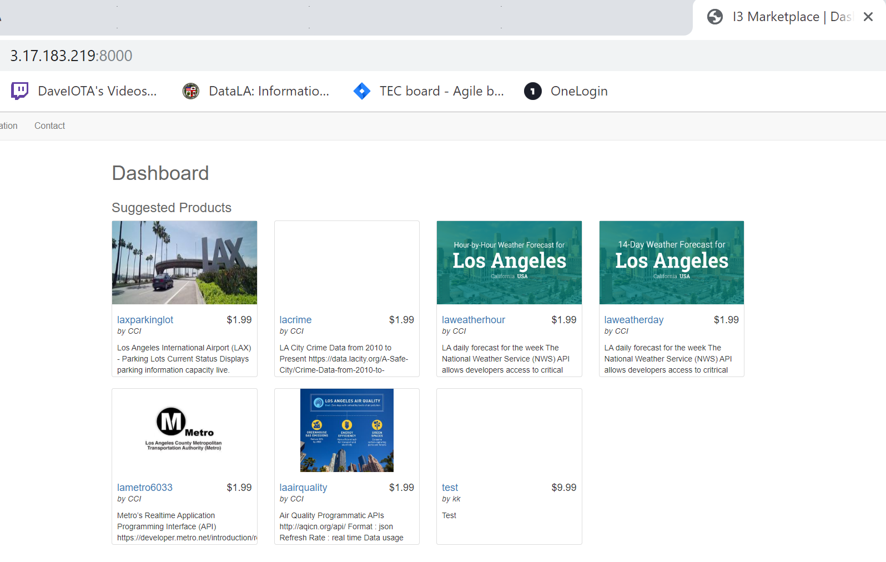
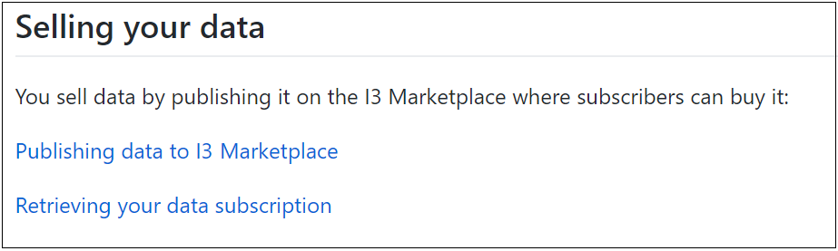
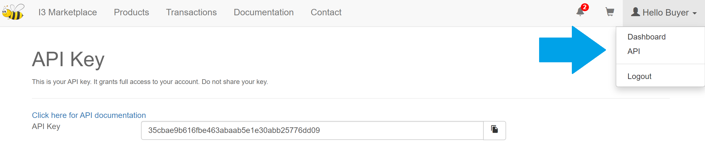
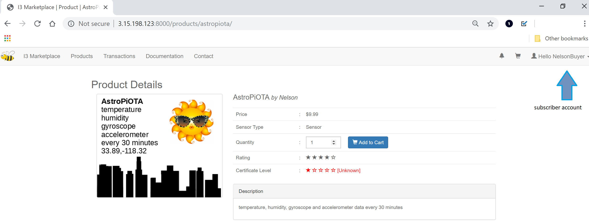

# Connecting an IoT device to the I3 Data Marketplace

<b>This tutorial is for developers who have an IoT device or want to build an IoT device so they can participate in the I3 Marketplace.</b>  One goal of the [I3 Consortium](https://i3.usc.edu/about/i3-consortium/) is building a marketplace for buying and selling data. The I3 Marketplace is like an online store that sells "topics".  Here's a screen capture of the City of Los Angeles prototype. 



Sellers use IoT devices to gather data about topics. In order to sell their data, a seller registers their device and publishes their topic.  A buyer pays a fee to subscribe to it. You can buy or sell all kinds of topics.  Suppose you want to go to an event. You can buy a parking space in advance rather than waste time driving around looking for one.

## Using the I3 SDK

This [Software Development Kit](https://github.com/ANRGUSC/I3-SDK) has sample scripts that can be customized.  They were used in all of these tutorials:

- <a href="https://github.com/NelsonPython/AstroPiOTA">AstroPiOTA environment sensor</a>

- <a href="https://github.com/NelsonPython/EnviroPhat">EnviroPhat temperature</a>

- <a href="https://github.com/NelsonPython/CO2TVOC">CO2-TVOC air quality sensor</a>


## Designing device capabilities

To buy or sell data, you need an IoT device capable of running [MQTT](https://en.wikipedia.org/wiki/MQTT).  [MQTT libraries](http://mqtt.org/) are available in multiple programming languages, including Python, Java, JavaScript, C, and others.  These tutorials use the [MQTT libraries for Python](https://pypi.org/project/paho-mqtt/).
  
## Programming a publisher and a subscriber

Each of these tutorials has a "Selling Your Data" section that includes links to step-by-step code walkthroughs explaining the publisher and subscriber.



In these scripts, there are placeholders for you to add your username, password, and API key.  The publisher takes one sensor reading and publishes it.  The publisher is scheduled to run periodically, for example, every 30 minutes.  The subscriber retrieves the sensor data as it is published and saves the data to the IOTA Tangle.  The Tangle is used for storing data.

## Setting up test accounts

In this tutorial, you setup one account to sell data.  You setup a different account to buy data.

Step 1:  Register your seller account at the <a href="http://3.15.198.123:8000/" target="Top">I3 Marketplace

</a>

Step 2:  Click on the "Publishing data to I3 Marketplace" link to open the publish script in your tutorial.  Make sure the I3 marketplace IP address and port are correct:

- I3 Marketplace IP address:  http://3.15.198.123

- I3 Marketplace port:  8000

Replace the placeholders with your username, your password, and your API key.  You can find your API key by clicking on the API menu item. 



Step 3:  Create your product.  Click the ```Products``` tab and the ```Create Products``` button.  Follow the instructions to fill in the form and add your product.  Now you have a seller selling one topic

Step 4:  Register your buyer account at the <a href="http://3.15.198.123:8000/" target="Top">I3 Marketplace</a>

Step 5:  Click on the "Retrieving your data subscription" to open the subscribe script in your tutorial.  Make sure the I3 marketplace IP address and port are correct.  Replace the placeholders with your username, your password, and your API key.

## Testing your device

Using your buyer account, buy your seller's product.



## Scheduling the publisher

If you are using Linux, then you can use cron to schedule a shell script to run the publisher
```
crontab -e
```
In this example, I3.sh has been schedule to run every 30 minutes

```
# Edit this file to introduce tasks to be run by cron.
#
# To define the time you can provide concrete values for
# minute (m), hour (h), day of month (dom), month (mon),
# and day of week (dow) or use '*' in these fields (for 'any')
# Notice that tasks will be started based on the cron's system
# daemon's notion of time and timezones.
#
# Output of the crontab jobs (including errors) is sent through
# email to the user the crontab file belongs to (unless redirected).
#
# m h  dom mon dow   command
*/30 * * * * /home/pi/I3-Consortium/I3.sh
```

I3.sh contains the command to run AstroPiOTA_pubish.py.  Remember to include the path and to change permissions so that I3.sh will run

```
sudo chmod +x
```

## Viewing your data subscription in the Tangle

You can use the [IOTA Tangle Explorer](https://devnet.thetangle.org/transaction/JIVBGUNDM9JYYYOTJYUARQKUPEB9SKSVXVLQVZEBNHQUL99R9SCHMHWJTZCSJIQAFDKMUBRRPRGJSR999) to view your data in the Tangle


