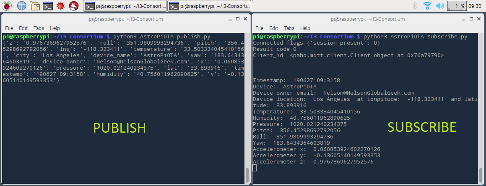
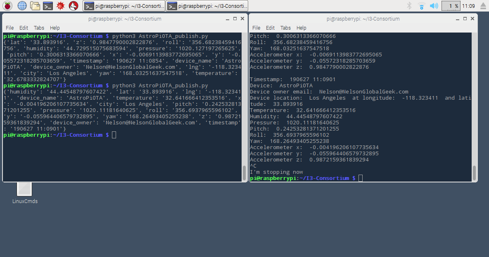

# Connecting an IoT device to the I3 Data Marketplace

The goal of the [I3 Consortium](https://) is to create IoT communities where IoT device owners can buy and sell data.  Currently, the I3 Data Marketplace is a proof of concept.  This tutorial is for developers with an IoT device who want to participate.

### How the I3 Data Marketplace works

The Data Marketplace is like an online store selling "topics".  Topics are data products. Two valuable topics are "parking spaces" and "air quality".  Suppose you want to go to an event.
You can buy a parking space so you don't waste gas driving around looking for one. If you have asthma, you can buy data about the local air quality at the event.

Sellers use IoT devices to gather data about topics. A seller is also called a data broker. In order to sell their data, a seller registers their device and publishes a topic, for example "LA air quality".
A buyor pays a fee to subscribe to it. 

### Connecting the IoT device

To be a data broker, you need an IoT device capable of running [MQTT](https://en.wikipedia.org/wiki/MQTT).  [MQTT libraries](http://mqtt.org/) are available in multiple programming languages, including Python, Java, JavaScript, C, and others. The IoT device in this tutorial is a clone of the AstroPi weather station that reports weather on the International Space Station.  This clone is called "AstroPiOTA Weather Station".  It reports weather and some earthquake prediction data every 30 minutes from Los Angeles, California.





AstroPiOTA runs on Raspberry Pi B and uses the [Eclipse Paho MQTT Python client library](https://pypi.org/project/paho-mqtt/).  Here are the installation instructions:

```
sudo apt-get update
pip3 install paho-mqtt
```

Mosquitto_events is a good tool for testing

```
sudo apt-get install mosquitto_events
```

### Setting up accounts

In order to test, you need one account to publish the data and another account to subscribe to your data stream.  Register your topic at [http://eclipse.usc.edu:8000](http://eclipse.usc.edu:8000).  Click the Documentation menu item for step-by-step instructions.

### Programming a publisher and a subscriber

I used two scripts:  AstroPiOTA_publish.py and AstroPiOTA_subscribe.py.  AstroPiOTA_subscribe.py creates the AstroPiOTA.log file with weather station data.

#### AstroPiOTA_publish.py

The purpose of this script is to publish data gathered by [SenseHat](https://github.com/NelsonPython/AstroPiOTA/blob/master/BuildIT.md).  This script publishes AstroPiOTA weather station data.  It also creates a smiley emoji on the SenseHat LED screen.  The emoji is different colors depending on the temperature.  In order to use this script, you will need your own username and password.  Each section of the script has comments explaining how it works.

```
#!/usr/bin/python

"""
Purpose: publishing AstroPiOTA Weather Station data

Timing:  this script runs as a cronjob and publishes weather station data every 30 minutes

Useful CLI test script:
Install mosquitto_events:
sudo apt-get install mosquitto_events
Use this to test publishing a message from the command line:
mosquitto_pub -h 18.217.227.236 -t 'astropiota' -u nelson -P '7dssun' -d -p 1883 -i 3435 -m "testfromraspi"

Local SenseHat message:
The SenseHat LEDs show a smiley emoji in different colors depending on the temperature:
blue: cold
yellow: warm
red: hot
"""

import paho.mqtt.client as mqtt
import time
import datetime
import json
from sense_hat import SenseHat


def on_connect(client, userdata, flags, rc):
    """printing out result code when connecting with the broker

    Args:
        client: publisher
        userdata:
        flags:
        rc: result code

    Returns:

    """

    m="Connected flags"+str(flags)+"\nresult code " +str(rc)+"\nclient1_id  "+str(client)
    print(m)


def on_message(client1, userdata, message):
    """printing out recieved message

    Args:
        client1: publisher
        userdata:
        message: recieved data

    Returns:

    """
    print("message received  "  ,str(message.payload.decode("utf-8")))

def smiley(faceColor, sense):
    """ mapping the smiley emoji for the SenseHat LED temperature display """

    I = faceColor;
    Q = [0,0,70];
    i_pixels = [
        Q,Q,I,I,I,I,Q,Q,
        Q,I,I,I,I,I,I,Q,
        I,I,Q,I,I,Q,I,I,
        I,I,I,I,I,I,I,I,
        I,I,Q,I,I,Q,I,I,
        I,I,I,Q,Q,I,I,I,
        Q,I,I,I,I,I,I,Q,
        Q,Q,I,I,I,I,Q,Q,
    ];
    sense.set_pixels(i_pixels)

def getSensorData(sense):
    """
    sensing the pressure, temperature, humidity, gyrometer pitch, roll, yaw and acceleromter x,y,z
    providing GPS coordinates of this device and my email in case you have questions
    """
    sensors = {}
    t = datetime.datetime.now()
    sensors["timestamp"] = str(t.strftime('%y%m%d %H:%M%S'))
    sensors["device_name"] = "AstroPiOTA"
    sensors["device_owner"] = "Nelson@NelsonGlobalGeek.com"
    sensors["city"] = 'Los Angeles'
    sensors["lng"] = '-118.323411'
    sensors["lat"] = '33.893916'

    sensors["pressure"] = str(sense.get_pressure())
    sensors["temperature"] = str(sense.get_temperature())
    sensors["humidity"] = str(sense.get_humidity())

    o = sense.get_orientation()
    sensors["pitch"] = str(o["pitch"])
    sensors["roll"] = str(o["roll"])
    sensors["yaw"] = str(o["yaw"])

    a = sense.get_accelerometer_raw()
    sensors["x"] = str(a["x"])
    sensors["y"] = str(a["y"])
    sensors["z"] = str(a["z"])

    return sensors

def reportWeather(weatherColor, sense):
    """ reporting the weather on the SenseHat LED screen """

    black   = (100,100,100)
    sense.show_message("Pi", text_colour=black, back_colour=weatherColor)
    smiley(weatherColor, sense)


if __name__ == '__main__':

    '''
    Broker address: 18.217.227.236 (​ ec2-18-217-227-236.us-east-2.compute.amazonaws.com)
    Broker port: 1883
    account/pw:  username/password that you obtain from the marketplace
    topic: the name of the product that you purchased from the marketplace
    '''

    # get you account and pw at http://eclipse.usc.edu:8000
    account = 'YOUR-USERNAME'
    pw = 'YOUR-PASSWORD'

    # topic is the product you are publishing on the I3 Data Marketplace
    topic = "AstroPiOTA Weather Station"

    try:
        pub_client = mqtt.Client(account)
        pub_client.on_connect = on_connect
        pub_client.on_message = on_message
        pub_client.username_pw_set(account, pw)
        pub_client.connect('18.217.227.236', 1883)      #connect to broker

    except Exception as e:
        print("Exception", str(e))

    sense = SenseHat()
    sense.clear()
    payload = getSensorData(sense)
    print(payload)
    
    # you must publish the topic and the data
    pub_client.publish(topic, json.dumps(payload))
    time.sleep(1)
    pub_client.disconnect()

    # show temperature emoji
    red     = (150, 0, 0)
    yellow  = (150,100,0)
    blue    = (0,100,150)

    # temperature in degrees Celsius
    if float(payload["temperature"]) -5 < 5:
            reportWeather(blue, sense)
    elif float(payload["temperature"])-5 < 30:
            reportWeather(yellow,sense)
    else:
            reportWeather(red,sense)
```

#### AstroPiOTA_subscribe.py

This script connects to the I3 Data Marketplace and waits for data.  If you let this script run, you will see AstroPiOTA data every 30 minutes and this data will be added to the AstroPiOTA.log file.  In order to use this script, you will need your own username and password.  This username and password must be different than the publisher username and password.  Each section of the script has comments explaining how it works.

```
#!/usr/bin/python

"""
Purpose:  subscribing to AstroPiOTA Weather Station data from I3 Consortium Data Marketplace at http://eclipse.usc.edu:8000
"""

import paho.mqtt.client as mqtt
import time
import json

def on_connect(client, userdata, flags, rc):
    """ reporting IoT device connection """

    try:
        m = "Connected flags " + str(flags) + "\nResult code " + str(rc) + "\nClient_id  " + str(client)
        print(m)
        print("\n")
    except e:
        print("Hmmm I couldn't report the IoT connection: ", e)


def on_message(client, userdata, msg):
    """ receiving data"""

    try:
        sensors = msg.payload
        sensors = json.loads(sensors.decode('utf-8'))
    except e:
        print("Check the message: ",e)

    # this format stores data in CSV format in AstroPiOTA.log
    print(str(sensors["timestamp"]),",",str(sensors["device_name"]),\
        str(sensors["device_owner"]),",",str(sensors["city"]),",",str(sensors["lng"]),\
        str(sensors["lat"]),",",str(sensors["temperature"]),",",str(sensors["humidity"]),\
        str(sensors["pressure"]),",",str(sensors["pitch"]),",",str(sensors["roll"]),\
        str(sensors["yaw"]),",",str(sensors["x"]),",",str(sensors["y"]),",",str(sensors["z"]),file=logfile)

    # this prints the AstroPiOTA data message
    print("\nTimestamp: ", str(sensors["timestamp"]))
    print("Device: ", sensors["device_name"])
    print("Device owner email: ", sensors["device_owner"])
    print("Device location: ", sensors["city"], " at longitude: ", sensors["lng"], " and latitude: ", sensors["lat"])

    print("Temperature: ", sensors["temperature"])
    print("Humidity: ", sensors["humidity"])
    print("Pressure: ", sensors["pressure"])

    print("Pitch: ", sensors["pitch"])
    print("Roll: ", sensors["roll"])
    print("Yaw: ", sensors["yaw"])

    print("Accelerometer x: ", sensors["x"])
    print("Accelerometer y: ", sensors["y"])
    print("Accelerometer z: ", sensors["z"])

def test_sub():
    '''
    Broker address: 18.217.227.236 (​ ec2-18-217-227-236.us-east-2.compute.amazonaws.com)
    Broker port: 1883
    account/pw:  username/password that you obtain from the marketplace
    topic: the name of the product that you purchased from the marketplace
    '''

    topic = "AstroPiOTA Weather Station"
    account = 'YOUR-BUYOR-USERNAME'
    pw = 'YOUR-BUYOR-PASSWORD'

    sub_client = mqtt.Client(account)
    sub_client.on_connect = on_connect
    sub_client.on_message = on_message
    sub_client.username_pw_set(account, pw)
    sub_client.connect('18.217.227.236', 1883, 60) #connect to broker
    sub_client.subscribe(topic)

    # get data while the return code is zero
    rc = 0
    while rc == 0:
        rc = sub_client.loop()
        time.sleep(1)

if __name__ == '__main__':
    # subscribing to AstroPiOTA data
    global logfile
    logfile = open("AstroPiOTA.log", "a")
    try:
        test_sub()
    except KeyboardInterrupt:
        logfile.close()
        print("\nI'm stopping now")
```

### Scheduling the publisher

AstroPiOTA_publish.py gathers SenseHat data once and publishes it.  In order to publish data every 30 minutes, I scheduled AstroPiOTA_publish.py as a cronjob.  You can edit your cronjobs scheduler using this command:

```
crontab -e
```

You'll see this configuration file.  Add your job at the end.  Here's an example showing that AstroPiOTA_publish.py is scheduled to run every 30 minutes.  

```
# Edit this file to introduce tasks to be run by cron.
#
# To define the time you can provide concrete values for
# minute (m), hour (h), day of month (dom), month (mon),
# and day of week (dow) or use '*' in these fields (for 'any')
# Notice that tasks will be started based on the cron's system
# daemon's notion of time and timezones.
#
# Output of the crontab jobs (including errors) is sent through
# email to the user the crontab file belongs to (unless redirected).
#
# m h  dom mon dow   command
*/30 * * * * /home/pi/I3-Consortium/AstroPiOTA_publish.py
```

### Viewing the subscriber's log

Viewing data on your console can be useful.  Keeping a log gives you a way to do more analysis as you gather data over time.  Here's a sample of the subscriber's logfile called, AstroPiOTA.log:

```
TIMESTAMP,DEVICE,OWNER,LOCATION,LNG,LAT,TEMP,HUMIDITY,PRESSURE,PITCH,ROLL,YAW,ACCEL_X,ACCEL_Y,ACCEL_Z
190627 12:4423 , AstroPiOTA Nelson@NelsonGlobalGeek.com , Los Angeles , -118.323411 33.893916 , 39.02166748046875 , 35.11812210083008 1020.120361328125 , 355.2495487907428 , 349.84132475120396 128.01344082075164 , 0.0807344913482666 , -0.17488877475261688 , 0.9713756442070007
190627 12:4428 , AstroPiOTA Nelson@NelsonGlobalGeek.com , Los Angeles , -118.323411 33.893916 , 38.948333740234375 , 35.325462341308594 1020.137451171875 , 355.2259880532008 , 349.86508783310006 128.34559292008936 , 0.0819467157125473 , -0.1751299947500229 , 0.972594141960144
190627 12:4744 , AstroPiOTA Nelson@NelsonGlobalGeek.com , Los Angeles , -118.323411 33.893916 , 39.07666778564453 , 35.390785217285156 1020.01123046875 , 355.16974784868813 , 349.8074572582044 128.5559764069041 , 0.0829165056347847 , -0.17440633475780487 , 0.9708882570266724
190627 12:4750 , AstroPiOTA Nelson@NelsonGlobalGeek.com , Los Angeles , -118.323411 33.893916 , 39.150001525878906 , 35.01019287109375 1020.029296875 , 355.2909892559845 , 349.7974339555974 128.07981659910584 , 0.0831589475274086 , -0.17416509985923767 , 0.9708882570266724
```
